# Eino Agent 可视化文档

本文档将 `eino-skill-examples/` 下的所有 Agent 结构可视化为 Mermaid 图表。

---

## 目录

1. [基础 Agent](#1-基础-agent)
   - [ReAct Agent](#react-agent)
   - [Hello World Agent](#hello-world-agent)
2. [Multi-Agent 协作模式](#2-multi-agent-协作模式)
   - [Supervisor 模式](#supervisor-模式)
   - [Deep Agent 模式](#deep-agent-模式)
   - [Layered Supervisor 模式](#layered-supervisor-模式)
   - [Plan-Execute-Replan 模式](#plan-execute-replan-模式)
3. [Workflow Agent](#3-workflow-agent)
   - [Sequential Agent](#sequential-agent)
   - [Parallel Agent](#parallel-agent)
   - [Loop Agent](#loop-agent)
4. [人机协作 (HITL)](#4-人机协作-hitl)
   - [Approval 模式](#approval-模式)
5. [高级 Agent](#5-高级-agent)
   - [Manus Agent](#manus-agent)
   - [Tool Call Agent Graph](#tool-call-agent-graph)
   - [Deer-Go Agent](#deer-go-agent)

---

## 1. 基础 Agent

### ReAct Agent

**文件位置**: `main.go`, `flow/agent/react/main.go`

ReAct = Reasoning + Acting，是最经典的 Agent 模式。

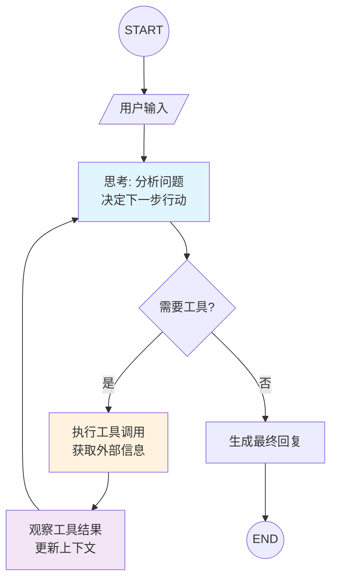

**特点**:
- 循环执行直到生成最终回复
- 支持多工具调用
- 自动处理工具调用循环

**代码示例**:
```go
agent, _ := react.NewAgent(ctx, &react.AgentConfig{
    ToolCallingModel: model,
    ToolsConfig: compose.ToolsNodeConfig{
        Tools: []tool.BaseTool{weatherTool},
    },
    MaxStep: 20,
})
```

---

### Hello World Agent

**文件位置**: `adk/helloworld/main.go`

最简单的 ADK Agent 示例，展示基础的对话能力。

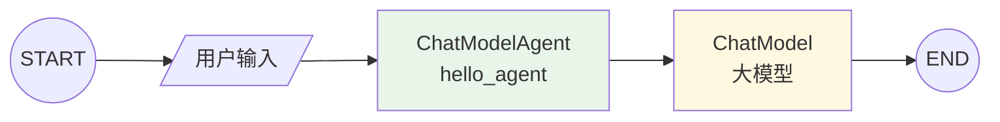

**特点**:
- 基于 ADK 的 ChatModelAgent
- 支持流式输出
- 最小化配置即可运行

**代码示例**:
```go
agent, _ := adk.NewChatModelAgent(ctx, &adk.ChatModelAgentConfig{
    Name:        "hello_agent",
    Description: "A simple hello world agent",
    Instruction: "You are a friendly assistant.",
    Model:       model,
})
```

---

## 2. Multi-Agent 协作模式

### Supervisor 模式

**文件位置**: `adk/multiagent/supervisor/main.go`

Supervisor 作为协调者，将任务分配给专业的子 Agent。

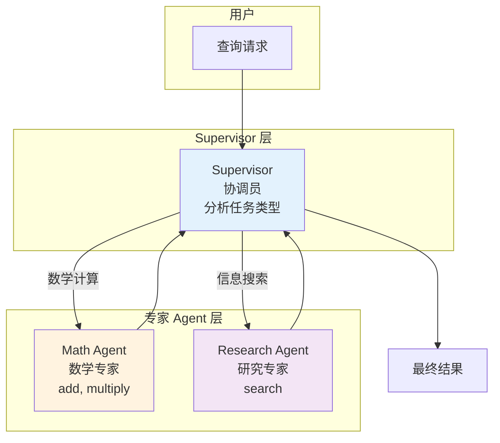

**特点**:
- Supervisor 分析任务并路由
- 支持任务转移 (TransferToAgent)
- 子 Agent 独立处理专业领域

**代码示例**:
```go
agent, _ := supervisor.New(ctx, &supervisor.Config{
    Supervisor: supervisorAgent,
    SubAgents:  []adk.Agent{mathAgent, researchAgent},
})
```

---

### Deep Agent 模式

**文件位置**: `adk/multiagent/deep/main.go`

分步骤处理模式，按照 理解 -> 分析 -> 报告 的顺序执行。

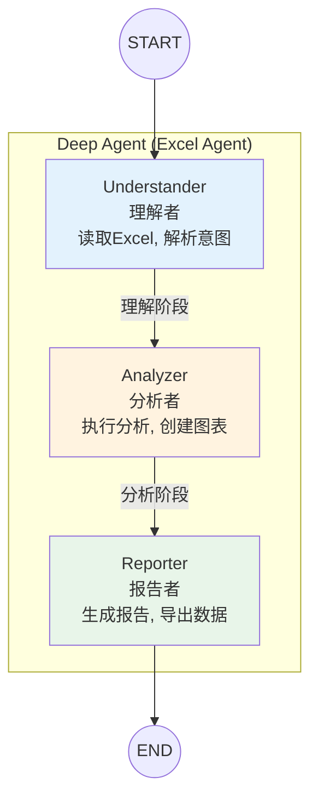

**特点**:
- 固定的执行顺序
- 每个 Agent 专注于一个阶段
- 适合数据分析类任务

**代码示例**:
```go
excelAgent, _ := deep.New(ctx, &deep.Config{
    Name:        "excel_agent",
    ChatModel:   model,
    SubAgents:   []adk.Agent{understander, analyzer, reporter},
})
```

---

### Layered Supervisor 模式

**文件位置**: `adk/multiagent/layered-supervisor/main.go`

多层 Supervisor 结构，形成层级化的任务分发体系。

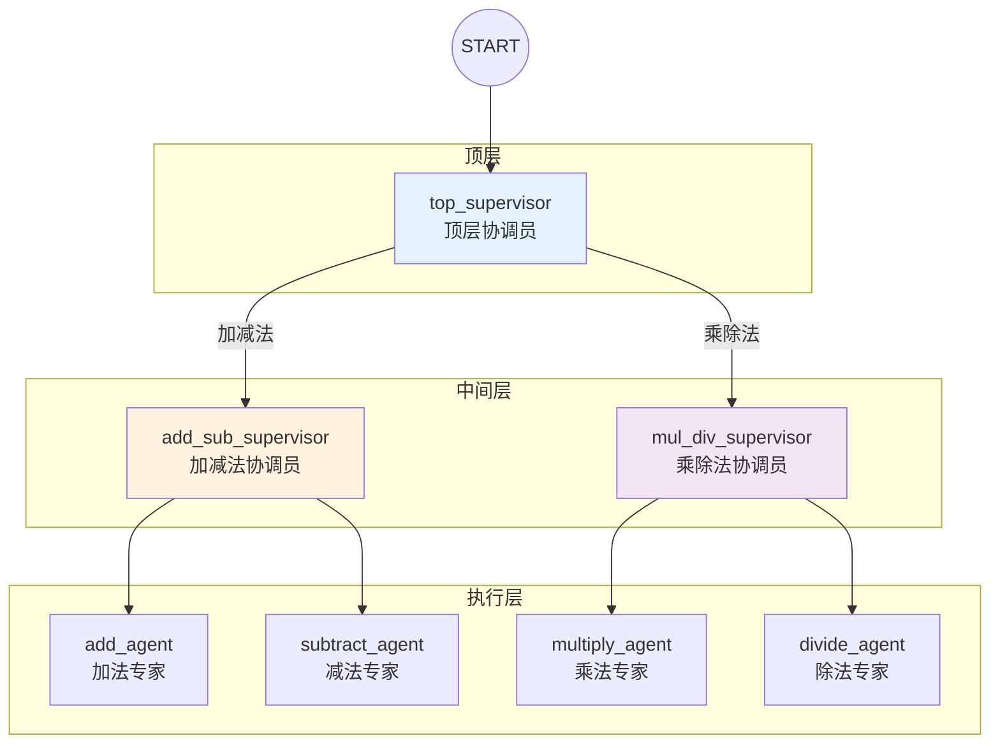

**特点**:
- 树状层级结构
- 每层 Supervisor 负责一类任务
- 支持更复杂的任务路由

**代码示例**:
```go
agent, _ := supervisor.New(ctx, &supervisor.Config{
    Supervisor: topSupervisor,
    SubAgents:  []adk.Agent{addSubLayer, mulDivLayer},
})
```

---

### Plan-Execute-Replan 模式

**文件位置**: `adk/multiagent/plan-execute-replan/main.go`

计划-执行-重规划的循环模式，适合复杂任务。

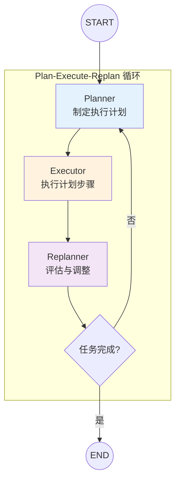

**特点**:
- 动态规划和调整
- 支持任务失败后的重新规划
- 适合不确定性高的任务

**代码示例**:
```go
agent, _ := planexecute.New(ctx, &planexecute.Config{
    Planner:   planner,
    Executor:  executor,
    Replanner: replanner,
})
```

---

## 3. Workflow Agent

### Sequential Agent

**文件位置**: `adk/intro/workflow/sequential/main.go`

顺序执行多个 Agent，前一个的输出作为后一个的输入。

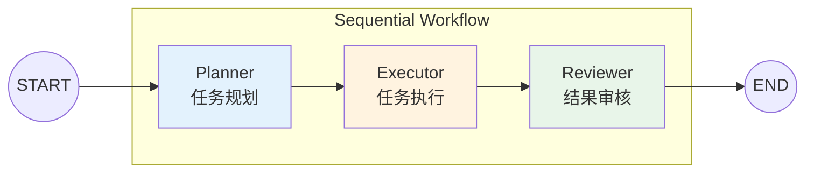

**特点**:
- 固定顺序执行
- 数据在 Agent 间传递
- 适合流水线式任务

**代码示例**:
```go
sequentialAgent, _ := adk.NewSequentialAgent(ctx, &adk.SequentialAgentConfig{
    Name:      "task_workflow",
    SubAgents: []adk.Agent{plannerAgent, executorAgent, reviewerAgent},
})
```

---

### Parallel Agent

**文件位置**: `adk/intro/workflow/parallel/main.go`

并行执行多个 Agent，然后合并结果。

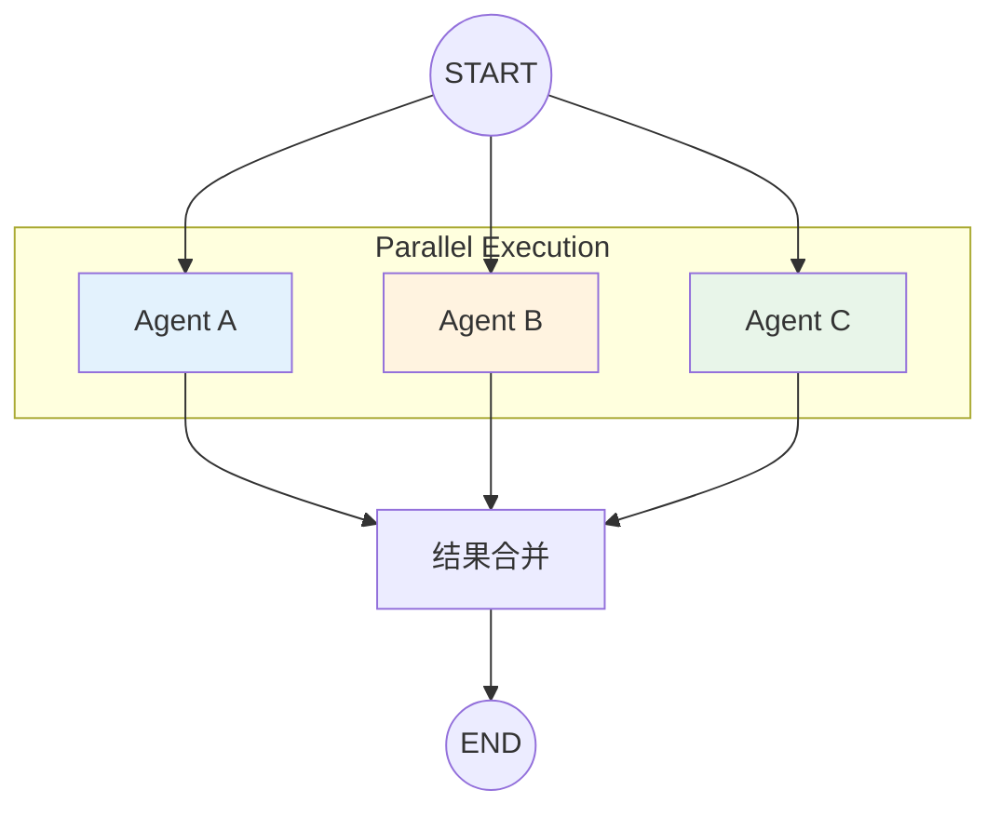

**特点**:
- 并行执行提高效率
- 适合独立子任务
- 结果合并后输出

---

### Loop Agent

**文件位置**: `adk/intro/workflow/loop/main.go`

循环执行直到满足条件。

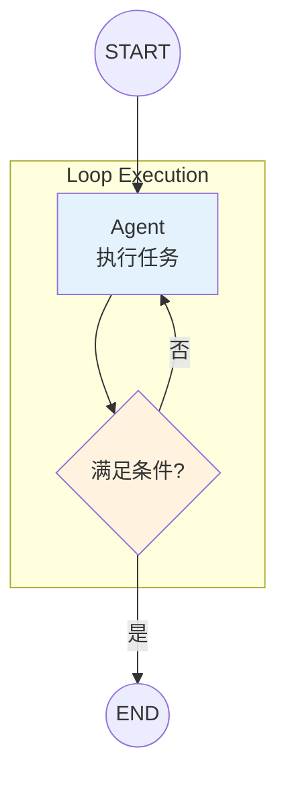

**特点**:
- 循环直到条件满足
- 适合迭代优化类任务
- 需要定义退出条件

---

## 4. 人机协作 (HITL)

### Approval 模式

**文件位置**: `adk/human-in-the-loop/1_approval/main.go`

在敏感操作前请求人工审批。

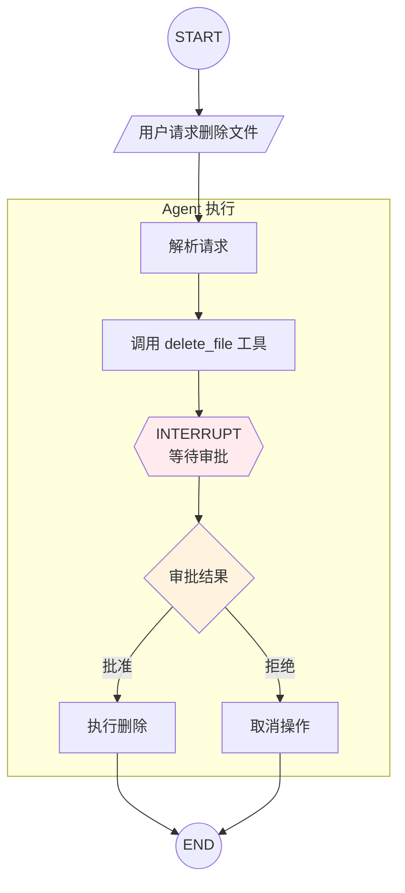

**特点**:
- 使用 `tool.StatefulInterrupt` 中断
- 使用 `runner.Resume` 恢复执行
- 适合敏感操作确认

**代码示例**:
```go
// 工具中断
return "", tool.StatefulInterrupt(ctx, approvalReq, input)

// 恢复执行
resumeIter, _ := runner.Resume(ctx, interruptID,
    adk.WithSessionValues(map[string]any{"approval": resumeData}),
)
```

---

## 5. 高级 Agent

### Manus Agent

**文件位置**: `flow/agent/manus/main.go`

参考 OpenManus 的自主 Agent，协调多个专业 Agent 完成复杂任务。

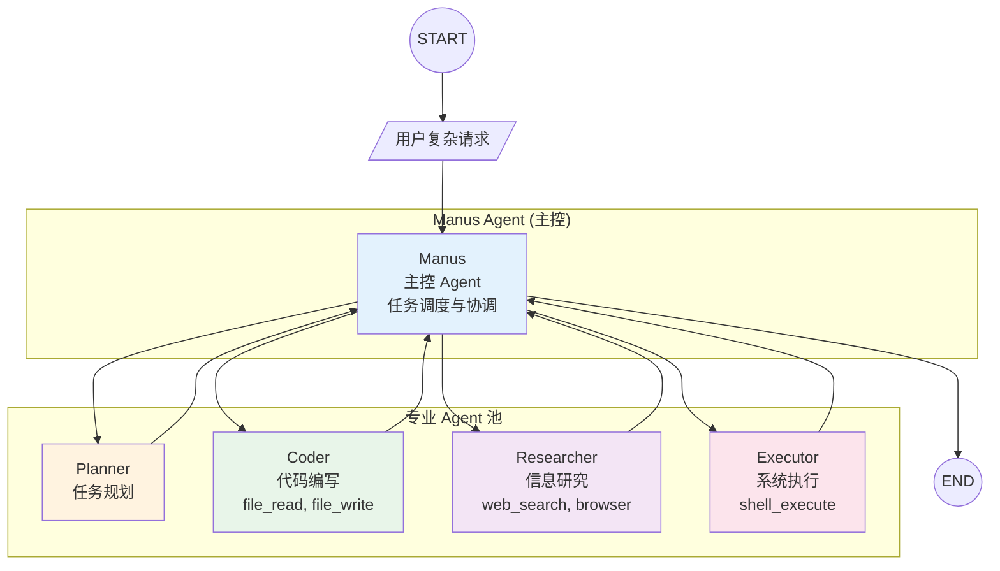

**特点**:
- 自主调度多个专业 Agent
- 支持并行和串行任务
- 适合复杂编程和研必任务

**代码示例**:
```go
manusAgentWithSubAgents, _ := adk.SetSubAgents(ctx, manusAgent, []adk.Agent{
    plannerAgent,
    coderAgent,
    researcherAgent,
    executorAgent,
})
```

---

### Tool Call Agent Graph

**文件位置**: `compose/graph/tool_call_agent/main.go`

使用 Graph 编排实现的手动 Tool Call Agent。

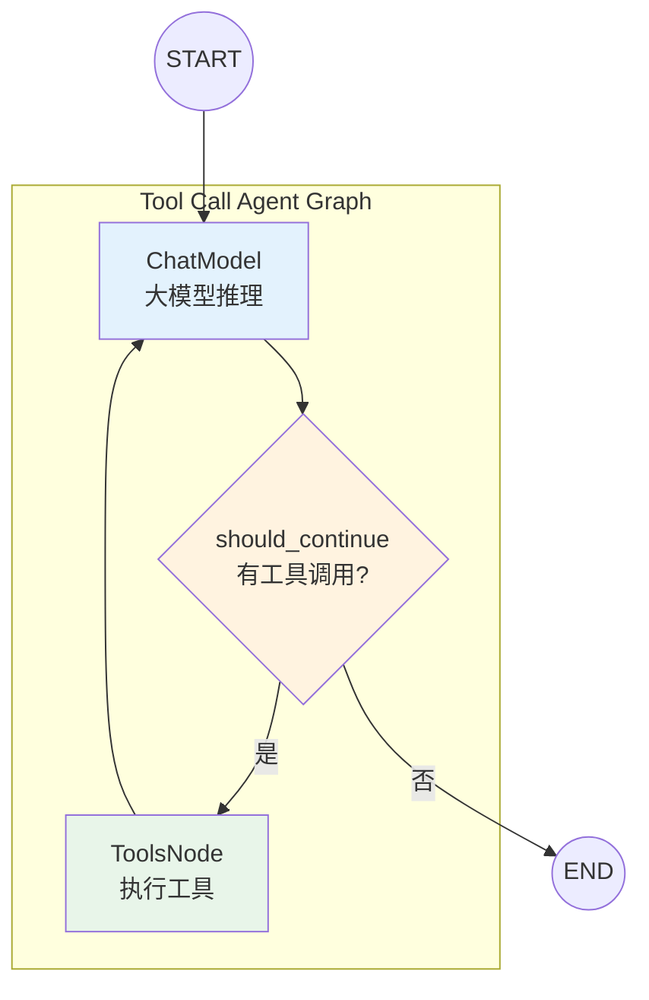

**特点**:
- 手动编排 Graph 结构
- 使用 Branch 控制循环
- 理解 ReAct 内部机制的最佳示例

**代码示例**:
```go
graph := compose.NewGraph[[]*schema.Message, *schema.Message]()
graph.AddChatModelNode("chat_model", model)
graph.AddToolsNode("tools", toolsNode)
graph.AddLambdaNode("should_continue", ...)
graph.AddBranch("should_continue", branch)
graph.AddEdge("tools", "chat_model")
compiled, _ := graph.Compile(ctx)
```

---

### Deer-Go Agent

**文件位置**: `flow/agent/deer-go/main.go`

参考 deer-flow 的研究团队协作模式，通过协调员调度多个专业 Agent 完成复杂研究任务。

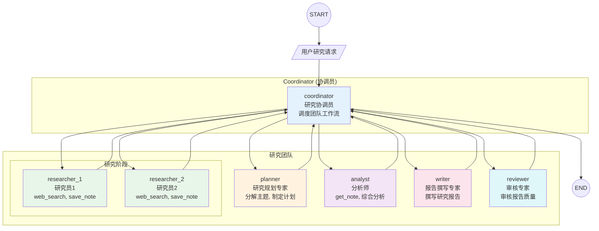

**特点**:
- 协调员模式，统一调度团队
- 支持并行研究（多研究员同时工作）
- 共享研究状态 (ResearchState)
- 完整的研究流程：规划 -> 研究 -> 分析 -> 撰写 -> 审核

**研究工具**:
- `web_search`: 搜索互联网获取研究资料
- `save_note`: 保存研究笔记
- `get_note`: 获取研究笔记

**代码示例**:
```go
coordinatorAgent, _ := adk.NewChatModelAgent(ctx, &adk.ChatModelAgentConfig{
    Name:        "coordinator",
    Description: "研究协调员，负责协调整个研究流程",
    Instruction: "协调团队成员：planner, researcher, analyst, writer, reviewer",
    Model:       model,
})

// 设置子 Agent
coordinatorAgentWithSubAgents, _ := adk.SetSubAgents(ctx, coordinatorAgent, team)

// 并行研究模式
parallelResearchAgent, _ := adk.NewParallelAgent(ctx, &adk.ParallelAgentConfig{
    Name:      "parallel_research",
    SubAgents: []adk.Agent{researcher1, researcher2},
})
```

**工作流程**:
1. **规划阶段**: planner 分析主题，分解子主题
2. **研究阶段**: researcher 并行搜索资料，保存笔记
3. **分析阶段**: analyst 综合研究笔记，发现洞察
4. **撰写阶段**: writer 撰写结构化研究报告
5. **审核阶段**: reviewer 审核报告质量

---

## 附录：Agent 模式对比

| 模式 | 适用场景 | 复杂度 | 灵活性 |
|------|----------|--------|--------|
| ReAct Agent | 简单问答、工具调用 | 低 | 中 |
| Supervisor | 多领域任务分发 | 中 | 高 |
| Deep Agent | 分阶段数据处理 | 中 | 低 |
| Layered Supervisor | 复杂层级任务 | 高 | 高 |
| Plan-Execute-Replan | 不确定性高任务 | 高 | 高 |
| Sequential Agent | 流水线任务 | 低 | 低 |
| Parallel Agent | 独立子任务并行 | 低 | 中 |
| Loop Agent | 迭代优化任务 | 低 | 中 |
| HITL Approval | 敏感操作确认 | 中 | 中 |
| Manus Agent | 复杂编程研必 | 高 | 高 |
| Deer-Go Agent | 研究团队协作 | 高 | 高 |

---

## 相关链接

- [Eino 官方文档](https://www.cloudwego.io/zh/docs/eino/)
- [Eino GitHub](https://github.com/cloudwego/eino)
- [Eino Examples](https://github.com/cloudwego/eino-examples)